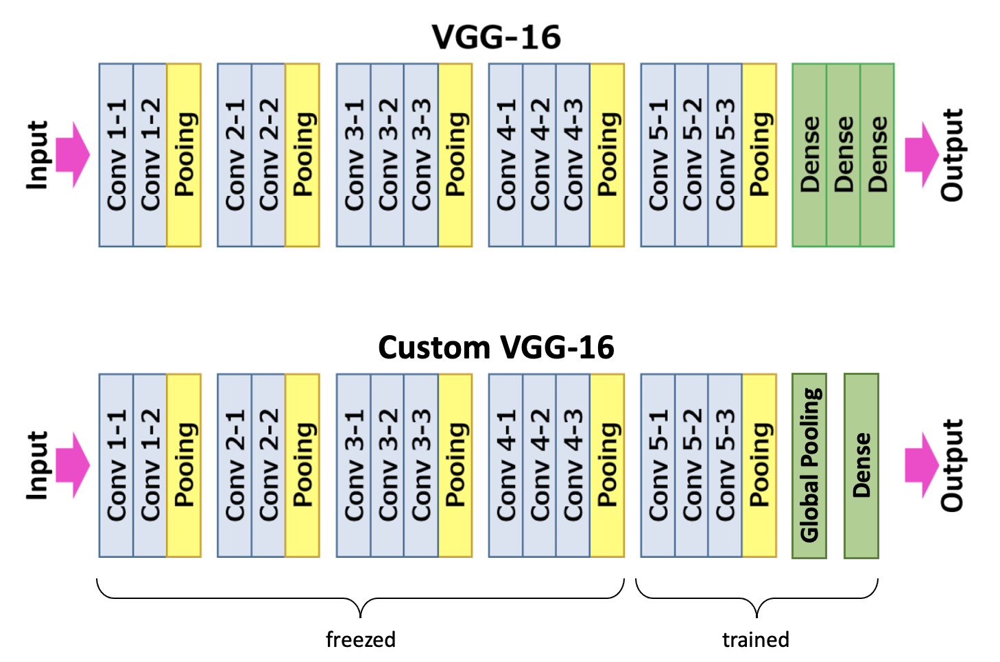

# Visual-Inspection

PyTorch Pipeline to train a model that classifies images as 'Good' / 'Anomaly'. Trained without any labels for defective regions, model in the inference mode is able to predict a bounding box for a defective region in the image. This is achieved by processing feature maps of the deep convolutional layers.

## Architecture

**Training.**
VGG16 feature extractor pre-trained on ImageNet, classification head - Average Global Pooling and a Dense layer. Model outputs 2-dimensional vector that contains probabilities for class 'Good' and class 'Anomaly'. Finetuned only last 3 convolutional layers and a dense layer. Loss is Cross-Entropy; optimizer is Adam with a learning rate of 0.0001.

*Model Training Pipeline:*

**Inference.**
During inference model outputs probabilities as well as the heatmap. Heatmap is the linear combination of feature maps from layer conv5-3 weighted by weights of the last dense layer, and upsampled to match image size. From the dense layer, we take only weights that were used to calculate the score for class 'defective'.

