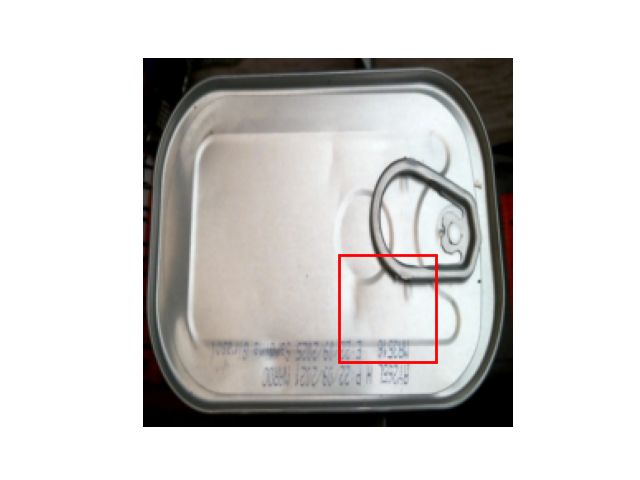

GUI application that detects defects in sardine cans during production. The deep learning model used can detect defects in more than just my dataset.

<h2>Project Screenshots:</h2>

     
  
  
  
  
  
  

 
<h2>🧐 Features</h2>

Here're some of the project's best features:

*   Import or take a picture of cans from 7 sides
*   Classify the can (Good/Bad)
*   Detect defects if the can is bad
*   Display heatmap

  
  
<h2>💻 Built with</h2>

Technologies used in the project:

*   Python
*   PyQt5
*   Pytorch
*   Opencv
*   Scikit-learn
*   Numpy
*   Matplotlib
*   Seaborn

## Architecture

**Training.**
VGG16 feature extractor pre-trained on ImageNet, classification head - Average Global Pooling and a Dense layer. Model outputs 2-dimensional vector that contains probabilities for class 'Good' and class 'Anomaly'. Finetuned only last 3 convolutional layers and a dense layer. Loss is Cross-Entropy; optimizer is Adam with a learning rate of 0.0001.

*Model Training Pipeline:*

**Inference.**
During inference model outputs probabilities as well as the heatmap. Heatmap is the linear combination of feature maps from layer conv5-3 weighted by weights of the last dense layer, and upsampled to match image size. From the dense layer, we take only weights that were used to calculate the score for class 'defective'.

*Model Inference:*

